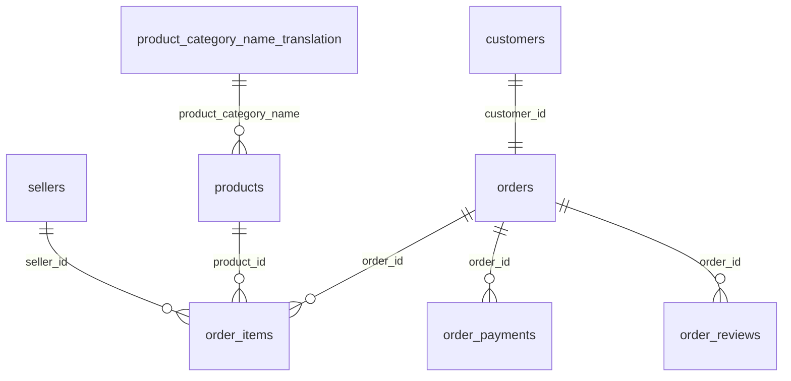

# Olist データメモ

Olist の生データ (`data/raw/*.csv`) について、調査でわかった仕様と注意点をまとめる。
ここには結論だけを書き、詳細な根拠は「[根拠](#根拠)」に挙げたスクリプト・notebook を参照する。

## 概要

- ブラジルの EC マーケットプレイス Olist の注文データ (9 テーブル)
- 期間: 2016-09-04 〜 2018-10-17 (`orders.order_purchase_timestamp`)

## テーブル一覧

| テーブル | 1 行が表すもの | 主キー候補 | 行数 |
|---|---|---|---:|
| `customers` | 注文ごとの顧客情報 | `customer_id` | 99,441 |
| `orders` | 1 注文 | `order_id` | 99,441 |
| `order_items` | 注文の明細 1 行 | (`order_id`, `order_item_id`) | 112,650 |
| `order_payments` | 注文に対する支払い 1 回 | (`order_id`, `payment_sequential`) | 103,886 |
| `order_reviews` | アンケート回答 × 対象の注文 | (`review_id`, `order_id`) | 99,224 |
| `products` | 1 商品 | `product_id` | 32,951 |
| `sellers` | 1 販売者 | `seller_id` | 3,095 |
| `geolocation` | 郵便番号 (先頭 5 桁) に対する緯度経度 1 点 | なし | 1,000,163 |
| `product_category_name_translation` | 商品カテゴリ名の英訳 | `product_category_name` | 71 |

## リレーション

`geolocation` は郵便番号が一意でないため、上の図には含めていない。
`customers` / `sellers` とは `*_zip_code_prefix` で結合できるが、1 対多になる。

「親」は参照される側、「子」は参照する側 (外部キーを持つ側)。関係は「親 : 子」の件数を表す。

| 親 | 子 | キー | 関係 | 親が見つからない子の行 | 備考 |
|---|---|---|---|---:|---|
| customers | orders | `customer_id` | 1:1 | 0 | `customer_id` は注文ごとに発行される |
| orders | order_items | `order_id` | 1:N | 0 | 明細が 1 件もない注文が 775 件 |
| orders | order_payments | `order_id` | 1:N | 0 | 支払いレコードがない注文が 1 件 |
| orders | order_reviews | `order_id` | 1:N | 0 | 1:1 ではない ([レビュー](#レビュー) を参照) |
| products | order_items | `product_id` | 1:N | 0 | |
| sellers | order_items | `seller_id` | 1:N | 0 | |
| product_category_name_translation | products | `product_category_name` | 1:N | 13 | 英訳がないカテゴリが 2 種類 |
| geolocation | customers | 郵便番号 | - | 278 | 緯度経度データにない郵便番号が 157 種類 |
| geolocation | sellers | 郵便番号 | - | 7 | 同上 (7 種類) |

## 注意点

### 読み込み

- **郵便番号 (`*_zip_code_prefix`) は文字列として読む。** 先頭が 0 のものがあり、数値として読むと 0 が消えて結合できなくなる。
- **日時の列は文字列として格納されている。** 日時型への変換が必要。
  - `orders`: `order_purchase_timestamp`, `order_approved_at`, `order_delivered_carrier_date`, `order_delivered_customer_date`, `order_estimated_delivery_date`
  - `order_items`: `shipping_limit_date`
  - `order_reviews`: `review_creation_date` (時刻は常に 00:00:00), `review_answer_timestamp`
- `products` の `product_name_lenght` / `product_description_lenght` は元データのスペルミス (`length` ではない)。
- **`order_reviews` のレビュー本文には、引用符で囲まれた改行が含まれる。** ファイルの行数 (104,719 行) とレコード数 (99,224 件) が一致しない。BigQuery に読み込むときは `allow_quoted_newlines` が必要。
- **`product_category_name_translation.csv` だけ、先頭に BOM がある。** UTF-8 として読むと最初の列名に BOM が混ざるため、`utf-8-sig` で読む。

### 顧客

- **`customer_id` は注文ごとに発行される ID で、人を表さない。** 同じ人を識別するには `customer_unique_id` を使う。
  - `customer_id`: 99,441 件 / `customer_unique_id`: 96,096 人
- **2 回以上購入した顧客は 2,997 人 (約 3%) しかいない。** 大半の顧客は 1 回しか購入していないため、購入回数を使った分析 (RFM の F など) ではほとんど差がつかない。

### 注文

- `order_status` の内訳: `delivered` 96,478 / `shipped` 1,107 / `canceled` 625 / `unavailable` 609 / `invoiced` 314 / `processing` 301 / `created` 5 / `approved` 2
- **明細 (`order_items`) が 1 件もない注文が 775 件ある。** 大半は `unavailable` (603 件) と `canceled` (164 件)。
- 配送日時は未配送の注文で欠損する (`order_delivered_customer_date` の欠損は 2,965 件)。

### レビュー

- **`order_reviews` は「1 注文 1 レビュー」のテーブルではない。** 1 行は「アンケート回答 (`review_id`) × 対象の注文 (`order_id`)」。
  - 1 注文に複数のレビューが付くことがある (547 注文)。日を空けた再回答や二重回答と見られる。
  - 1 つのレビューが複数の注文に紐づくことがある (789 レビュー / 1,412 注文)。同じ顧客がほぼ同時に購入した注文で、内容は完全に同じ。
- **レビューを使うときは、分析の単位に応じて重複を除く・集約する必要がある。** 方針はまだ決めておらず、分析の単位や特徴量の設計に合わせて決める。
- レビュー作成日が購入日より前という、時系列が矛盾した行が 64 行ある (うち 57 行はキャンセルされた注文)。
- コメントは任意入力のため、`review_comment_title` (87,656 件) と `review_comment_message` (58,247 件) は欠損が多い。

### 商品・地理

- `products` の 610 件はカテゴリ名などが欠損している。
- 英訳がないカテゴリ: `pc_gamer`, `portateis_cozinha_e_preparadores_de_alimentos`
- `geolocation` は 1 つの郵便番号に複数の緯度経度があり (19,015 種類の郵便番号に対して 100 万行)、まったく同じ内容の行も 261,831 行ある。結合する前に郵便番号ごとに集約する必要がある。

## 根拠

| 内容 | 場所 |
|---|---|
| 行数・データ型・欠損数・ID の重複 | [src/inspect_data.py](../src/inspect_data.py) |
| 主キー・参照整合性・カーディナリティ | [src/check_relationships.py](../src/check_relationships.py) |
| `order_reviews` の重複 | [notebooks/01_order_reviews_duplicates.ipynb](../notebooks/01_order_reviews_duplicates.ipynb) |

上記以外の数値 (`order_status` の内訳、2 回以上購入した顧客数、`geolocation` の重複行など) は、このメモを書く際にその場で集計したもの。
